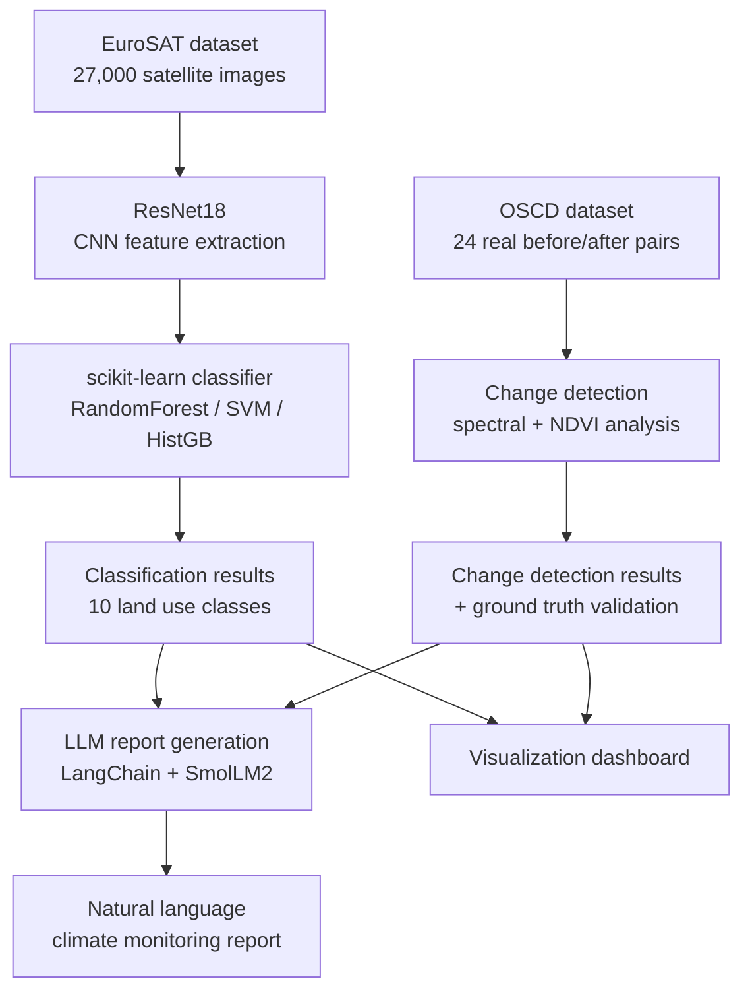
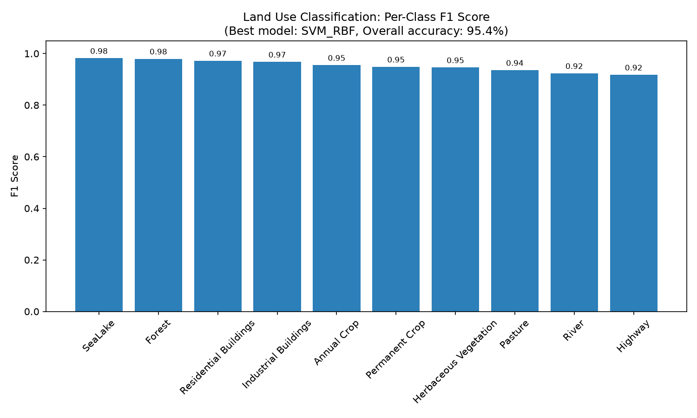
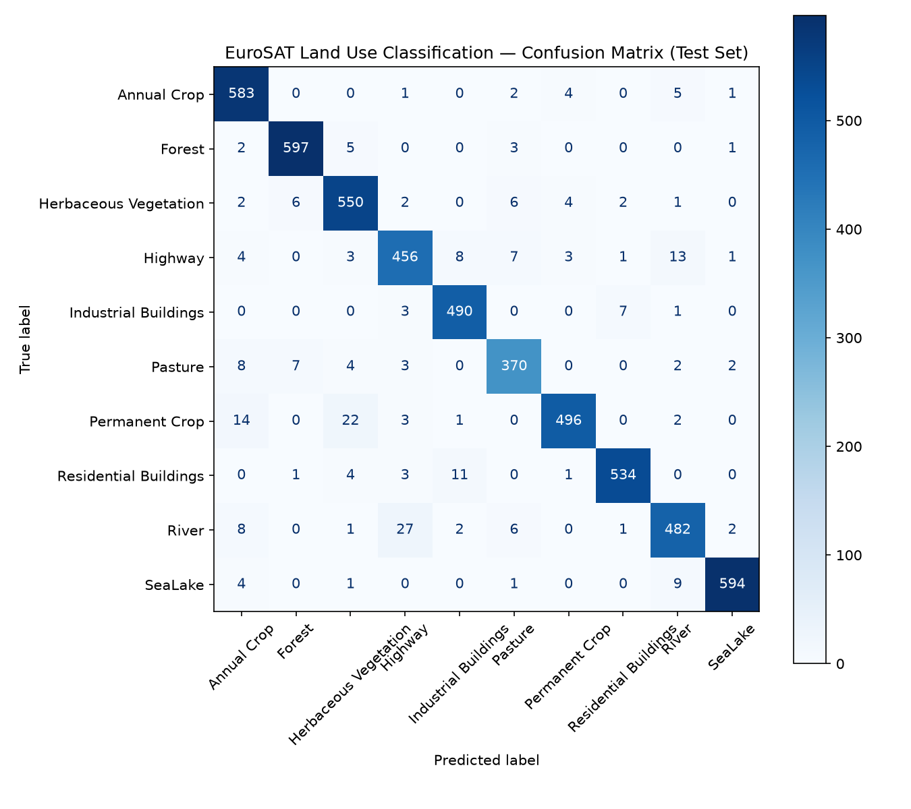
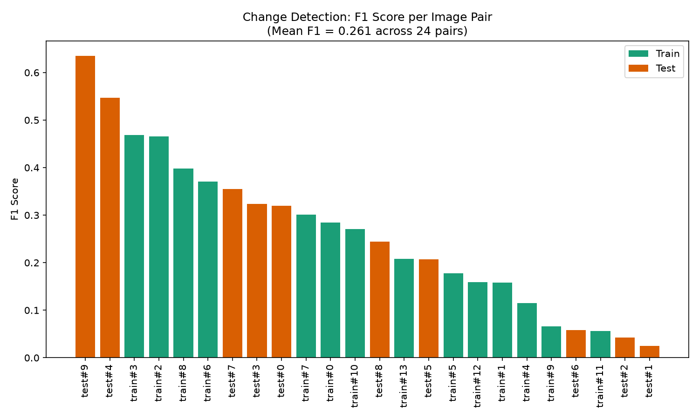
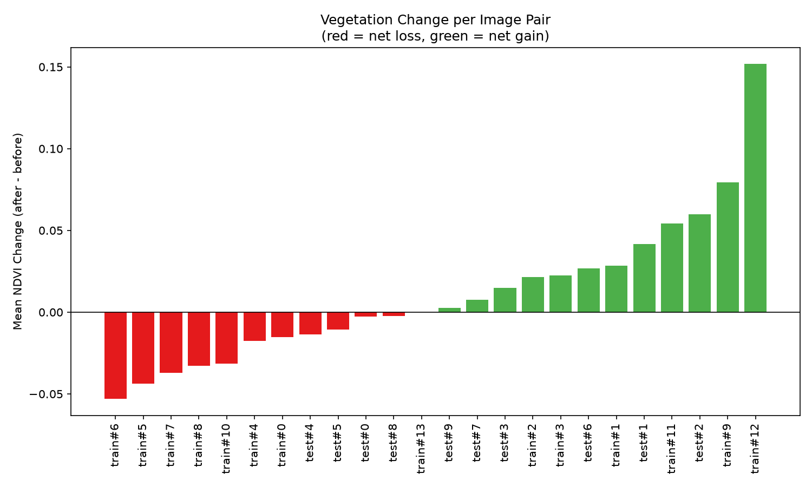
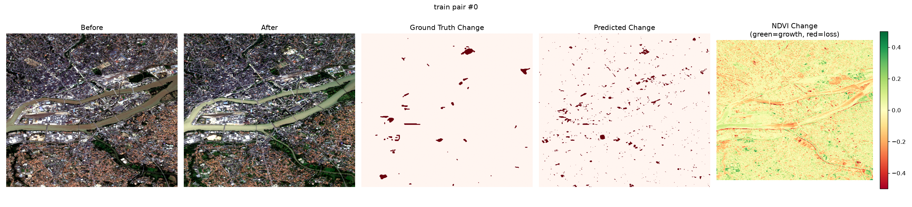
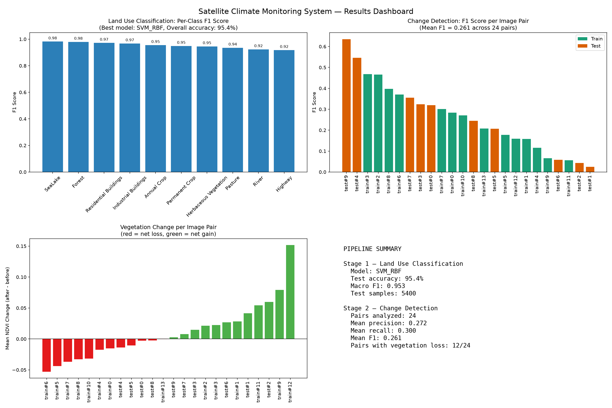

# Satellite Image-Based Climate Monitoring System

An end-to-end machine learning pipeline for satellite-based environmental monitoring: land use classification, change detection between real before/after satellite image pairs, and automated natural language reporting — built entirely on real, publicly available satellite imagery (no synthetic data anywhere in the pipeline).

## Architecture



## Datasets

Both datasets are real, publicly available satellite imagery — no synthetic or generated data is used anywhere in this pipeline.

| Dataset | Source | Size | Used for |
|---|---|---|---|
| **EuroSAT** | [`blanchon/EuroSAT_RGB`](https://huggingface.co/datasets/blanchon/EuroSAT_RGB) on Hugging Face | 27,000 labeled Sentinel-2 RGB images, 10 classes | Land use classification |
| **OSCD** (Onera Satellite Change Detection) | [`blanchon/OSCD_MSI`](https://huggingface.co/datasets/blanchon/OSCD_MSI) on Hugging Face | 24 real registered Sentinel-2 before/after pairs, 13 spectral bands, with real pixel-level change ground truth | Change detection |

## Stage 1: Land Use Classification

**Feature extraction.** A pre-trained ResNet18 (ImageNet weights) is used as a fixed feature extractor — no fine-tuning. Each 64×64 EuroSAT image is upscaled to 224×224 and passed through the network, taking the 512-dimensional penultimate (avgpool) layer as its feature vector:

```math
f_{\text{ResNet18}} : \mathbb{R}^{224 \times 224 \times 3} \rightarrow \mathbb{R}^{512}
```

**Classification.** Three scikit-learn classifiers are trained on these embeddings and compared on a held-out validation set: Random Forest, RBF-kernel SVM, and HistGradientBoosting.

### Results

**Best model: SVM (RBF kernel)**

| Metric | Value |
|---|---|
| Test accuracy | **95.4%** |
| Macro-averaged F1 | 0.953 |
| Test set size | 5,400 images |
| Strongest class | SeaLake (F1 = 0.982) |
| Weakest class | Highway (F1 = 0.918) |





## Stage 2: Change Detection

EuroSAT has no real temporal pairs, so this stage uses the OSCD dataset instead: 24 genuinely real Sentinel-2 before/after image pairs with real, pixel-level urban change ground truth (new buildings, new roads).

Two purely statistical indicators are computed per pair — no trained model, just NumPy/Pandas:

**1. Spectral change magnitude.** The mean absolute difference across all 13 Sentinel-2 bands, normalized per-band by that band's own standard deviation so no single band dominates:

```math
\Delta(x,y) = \frac{1}{13}\sum_{b=1}^{13} \frac{\left| I_2^{\,b}(x,y) - I_1^{\,b}(x,y) \right|}{\sigma_b}
```

A pixel is flagged as changed if it exceeds the image's own mean plus two standard deviations:

```math
\text{Change}(x,y) = \begin{cases} 1 & \text{if } \Delta(x,y) > \mu_\Delta + 2\sigma_\Delta \\ 0 & \text{otherwise} \end{cases}
```

**2. NDVI (vegetation index) change.** Computed from the Red and Near-Infrared bands, before vs. after, to flag vegetation loss (deforestation-style signal):

```math
\text{NDVI} = \frac{\text{NIR} - \text{Red}}{\text{NIR} + \text{Red}}
```

OSCD's ground truth only labels urban change, not vegetation, so this indicator is reported descriptively rather than scored against a label.

**Validation** against real ground truth uses standard precision/recall/F1:

```math
\text{Precision} = \frac{TP}{TP + FP} \qquad \text{Recall} = \frac{TP}{TP + FN} \qquad F_1 = \frac{2 \cdot \text{Precision} \cdot \text{Recall}}{\text{Precision} + \text{Recall}}
```

### Results (validated against real ground truth, 24 pairs)

| Metric | Value |
|---|---|
| Mean precision | 0.272 |
| Mean recall | 0.300 |
| Mean F1 | 0.261 |
| Mean pixel-level accuracy | 95.6% |
| Pairs with net vegetation loss | 12 / 24 |

An unsupervised statistical threshold scoring 0.26 F1 against real pixel-level urban-change labels is a modest but legitimate result — this task is meaningfully harder than Stage 1's classification, and the honest number is reported here rather than tuned to look better.





Example before/after/ground-truth/predicted visualization for one pair:



## Stage 3: LLM Report Generation

Uses `HuggingFaceTB/SmolLM2-1.7B-Instruct` (a small model built for on-device summarization), loaded via `transformers` and orchestrated through `langchain_huggingface`'s `ChatHuggingFace`. The model receives only the real computed statistics from Stages 1 and 2 and is instructed never to invent numbers. The generated report includes both the LLM's narrative and a raw data appendix with the exact figures, so nothing in the report's actual numbers depends on the model's accuracy.

See `outputs/reports/climate_monitoring_report.md` for the generated report.

## Results Dashboard



## Project Structure

```
satellite-climate-monitor/
├── src/
│   ├── __init__.py
│   ├── data.py         # EuroSAT download + preprocessing
│   ├── features.py     # CNN feature extraction (ResNet18)
│   ├── classifier.py   # scikit-learn land use classification
│   ├── detector.py     # OSCD change detection
│   ├── reporter.py     # LangChain + HuggingFace LLM report generation
│   └── visualize.py    # Summary charts
├── outputs/            # Saved models, reports, plots (generated by running the pipeline)
├── main.py             # Full pipeline entry point
└── requirements.txt    # Dependencies
```

## Setup

Requires Python 3.13 on Windows (or adapt paths for other platforms).

```powershell
python -m venv venv
.\venv\Scripts\activate
pip install --upgrade pip
pip install -r requirements.txt
```

## Running the Pipeline

Run everything in order (skips stages that are already complete):

```powershell
python main.py
```

Force a full rerun of everything:

```powershell
python main.py --force
```

Run a specific stage (or comma-separated list of stages):

```powershell
python main.py --only classifier
python main.py --only detector,reporter
```

Or run any stage standalone:

```powershell
python src\data.py
python src\features.py
python src\classifier.py
python src\detector.py
python src\reporter.py
python src\visualize.py
```

## Stack

Python · PyTorch · TorchVision · TensorFlow · Scikit-learn · Hugging Face Transformers & Datasets · LangChain · Pandas · NumPy · Matplotlib · Pillow

## Notes & Honesty Disclosures

- All results above are real numbers from real runs on real data — no cherry-picking or synthetic placeholders.
- The OSCD dataset has a schema quirk: it declares a fixed image shape that doesn't match the actual (variable, per-city) image dimensions. `detector.py` reads the raw Arrow data directly to work around this rather than relying on the library's default (and broken, for this dataset) decoder.
- The NDVI-based vegetation change indicator is descriptive only; OSCD's ground truth covers urban change, not vegetation, so there is no independent label to validate it against.
- The LLM is small (1.7B parameters, CPU-friendly) and occasionally phrases things imprecisely — hence the raw data appendix included alongside every generated report.
